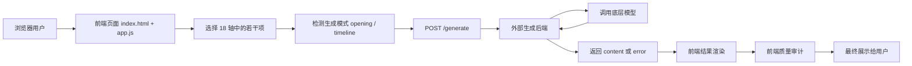

[English Summary](#english-summary) | [中文](#中文文档)

# English Summary

## OC Fate Generator

OC Fate Generator is a static web frontend for generating male OC setups and fate arcs through a compositional 18-axis system.

This repository contains the frontend application only:

- axis definitions and interaction rules
- browser-side selection and validation logic
- model selector and request assembly
- generated-text rendering
- Phase 1 client-side quality audit

The currently deployed backend source is not included in this repository. The frontend calls an external `/generate` API and expects JSON in one of the following shapes:

```json
{
  "content": "markdown-like generated text"
}
```

```json
{
  "error": "error message"
}
```

### Verified Deployment Topology

Verified against the public deployment on March 18, 2026:

- `http://www.lnln.fun/oc-gen/` is served by `AliyunOSS`
- the frontend is configured to call:
  `https://oc-geneator-api-iqzixhxuwa.cn-hangzhou.fcapp.run/generate`

### Runtime Flow

1. The user selects one option per axis, with at least 3 axes required.
2. The frontend switches between `opening` and `timeline` mode based on whether `F / X / T / G` are selected.
3. The browser POSTs `{ selections, model, extraPrompt }` to the external API.
4. The backend returns generated text.
5. The frontend renders the result and runs a local quality-audit pass.

### Repository Scope

Current repository contents:

- `index.html`
- `app.js`
- `styles.css`
- `docs/axis-design-guide.md`

Historical note:

- older commits contained a `worker/` backend directory
- that backend was removed in commit `1eddb05`

---

# 中文文档

## 项目简介

`OC Fate Generator` 是一个基于 18 轴组合系统的男主 OC 设定与命运骨架生成器。

它的核心思路不是把“角色标签”随机拼接成一段文本，而是先把角色设计拆成可组合、可联动、可约束的结构化维度，再将这些维度交给后端模型进行生成。最终输出的不只是一个人设简介，而是尽量包含角色逻辑、关系动力、叙事压力、代价与终局方向的成型文本。

这个项目当前采用的是“静态前端 + 外部生成后端”的架构：

- 前端负责轴系统展示、用户选择、模型选择、请求发送、结果渲染和基础审计
- 后端负责 prompt 组装、模型调用和文本生成
- 静态页面部署在阿里云 OSS
- 生成接口部署在独立的云函数地址上

在线地址：

- 体验页：`http://www.lnln.fun/oc-gen/`

## 这个仓库包含什么

本仓库是当前公开的前端代码仓库，主要包含以下内容：

- `index.html`
  页面结构、控件布局和部分内联样式。
- `app.js`
  项目的主要运行逻辑，包含 18 轴定义、帮助弹窗、模型列表、请求逻辑、结果解析与质量审计。
- `styles.css`
  配套样式文件。当前页面仍然以内联样式为主，这个文件更多是保留和补充样式定义。
- `docs/axis-design-guide.md`
  轴系统设计文档，包含轴定义、风险组合、失败类型和设计背景。

本仓库当前不包含：

- 线上 `/generate` 接口源码
- OSS 上传脚本
- 云函数部署脚本
- 服务端密钥配置
- 当前线上环境中的模型调用实现

历史上这个仓库曾经包含 `worker/` 目录，用于承载后端实现；该目录已经在提交 `1eddb05` 中移除。因此，本仓库当前应当被理解为一个完整的前端仓库，而不是一个包含现网后端的全栈仓库。

## 核心设计目标

这个项目的目标，不是快速给出一个“看起来像设定”的短文本，而是通过结构化输入，让生成结果具备更强的内部一致性。

具体来说，它希望解决的是以下几个问题：

- 普通角色生成器容易停留在 trope 堆砌层面，缺少内在因果
- 关系张力、代价、终局经常彼此脱节
- 用户输入过于自由时，后端 prompt 很难稳定控制输出结构
- 生成结果虽然表面华丽，但经常缺乏可追溯的角色逻辑

通过轴系统，项目把“世界阻力、身体边界、力量类型、动机、抉择、关系权力、爱的真伪、代价、终局”等关键因素拆分出来，并通过规则显式规定这些维度如何相互作用。

## 18 轴系统总览

项目使用 18 个轴来组织输入，每个轴只允许选择一个选项。

| 代码 | 轴名 | 作用 |
|------|------|------|
| `W` | World | 世界约束、类型规则、外部阻力 |
| `B` | Body | 身体形态、触碰边界、物种或存在方式 |
| `P` | Power | 力量来源、作用方式和气场类型 |
| `R` | Role | 角色与秩序的关系 |
| `M` | Motive | 核心驱动力 |
| `C` | Choice | 在压力下如何作出抉择 |
| `E` | Expression | 情感与关系表达方式 |
| `J` | Judgment | 共情方式与理解他人的能力 |
| `S` | Sanity | 心智稳定性与感知可靠性 |
| `D` | Dynamic | 关系中的权力结构 |
| `V` | View | 他如何看待“你” |
| `L` | Love | 爱的真伪与依恋本质 |
| `A` | Achilles | 软肋触发点 |
| `T` | Time | 时间压力、寿命差、记忆侵蚀等时序变量 |
| `G` | God-mode | 权限范围与改写现实的能力 |
| `X` | eXchange | 牺牲、代价、交换逻辑 |
| `F` | Finale | 终局形态 |
| `Palette` | 调色板 | 最终文本风格和审美包装 |

从代码结构上看，这 18 个轴不只是简单的展示数据，而是整个项目输入模型的骨架：

- `AXES` 负责定义用户可选项
- `AXIS_LABELS` 负责统一命名
- `AXIS_WISDOM` 负责为每个轴提供核心设计概念
- `AXIS_LINKS` 负责展示重点联动关系
- `AXIS_DETAILS` 负责在帮助弹窗中提供完整解释

这意味着轴系统既是用户界面的内容来源，也是后续生成行为的语义约束来源。

## 轴之间的关键联动

项目并不是把 18 个轴并列堆在一起，而是明确写出了若干关键联动关系。这些联动关系决定了生成结果为什么“像一个有因果的设定”，而不只是词语叠加。

当前前端中明确强调的联动包括：

- `W -> C`
  世界越残酷，抉择越痛，外部规则直接提高角色作出选择时的代价。
- `M -> C`
  抉择必须和动机互相解释，角色的选择不能脱离底层驱动力。
- `E + J`
  表达方式与共情能力共同决定沟通模式，输出和输入一旦错配，就会产生误会和摩擦。
- `D + V`
  权力结构与凝视方式共同决定关系动力，谁掌控关系、谁被定义、谁先低头，都在这里被塑造。
- `L + A`
  爱的真伪与软肋位置共同决定关系深度，尤其决定这段关系究竟是“爱这个人”还是“依赖这个人提供的功能”。
- `T + F`
  时间压力与终局形态共同决定叙事弧线，时间不是背景，而是推动终局的刀。
- `X + M`
  代价必须与动机相连，角色愿意付出什么，取决于他到底在为哪种价值让步。

这组联动关系，是整个生成器最重要的结构设计之一。

## 输入规则与交互逻辑

页面初始化后，前端会在浏览器中完成以下流程：

1. 获取页面中的核心 DOM 节点
2. 根据 `AXES` 渲染全部轴与选项
3. 渲染模型下拉框
4. 从 `localStorage` 读取上次保存的模型
5. 绑定生成事件
6. 根据选择数实时更新按钮状态

前端当前强制执行两条输入约束：

- 每个轴最多选择一个选项
- 至少选择 3 个轴才能生成

这两个限制直接服务于生成质量：

- “每轴单选”保证输入语义足够明确
- “至少 3 轴”保证输入具备最基本的叙事密度

## 双生成模式

项目存在两种不同的生成模式，由用户是否选择命运推进相关轴来决定。

模式判断规则如下：

- 未选择 `F / X / T / G` 时，进入 `opening` 模式
- 只要选择了任意一个 `F / X / T / G`，进入 `timeline` 模式

这两种模式代表两种不同的生成重心：

### Opening 模式

用于生成更偏角色起点的内容，通常更强调：

- 角色设定
- 气质和关系起点
- 开场场景
- 第一阶段冲突感

### Timeline 模式

用于生成更偏命运结构的内容，通常更强调：

- 命运骨架
- 代价链条
- 关系推进
- 时间压力
- 终局走向

因此，这个项目并不是“一个页面，一个固定 prompt”，而是“一个结构化输入前端，驱动至少两类不同输出框架”。

## 模型选择逻辑

前端内置了多个可切换模型选项，并将用户最近使用的模型保存在浏览器本地：

- `Pro/MiniMaxAI/MiniMax-M2.5`
- `Pro/zai-org/GLM-5`
- `Pro/moonshotai/Kimi-K2.5`
- `Pro/moonshotai/Kimi-K2-Instruct-0905`
- `Pro/deepseek-ai/DeepSeek-V3.2`
- `Pro/deepseek-ai/DeepSeek-V3.1-Terminus`
- `Pro/deepseek-ai/DeepSeek-V3`
- `Pro/zai-org/GLM-4.7`

默认模型为：

- `Pro/MiniMaxAI/MiniMax-M2.5`

模型选择会写入浏览器中的 `localStorage.oc_model`，下次打开页面时自动恢复。这使得前端本身承担了一层模型路由入口的角色，而不是把模型固定写死在服务端接口中。

## 请求与响应契约

前端向后端发送的请求体结构如下：

```json
{
  "selections": [
    { "axis": "W", "option": "W1 铁律之笼", "code": "W1" },
    { "axis": "M", "option": "M1 外部使命", "code": "M1" },
    { "axis": "E", "option": "E1 冰山闷骚", "code": "E1" }
  ],
  "model": "Pro/MiniMaxAI/MiniMax-M2.5",
  "extraPrompt": ""
}
```

其中：

- `selections`
  为用户当前的轴选择结果，每项包含轴代码、选项名称和选项代码。
- `model`
  为用户当前选择的模型标识。
- `extraPrompt`
  为用户补充的自由偏好描述。

前端期望后端返回以下两种 JSON 之一：

成功：

```json
{
  "content": "模型生成的正文"
}
```

失败：

```json
{
  "error": "错误信息"
}
```

前端还实现了以下运行时行为：

- 请求超时时间为 `120s`
- 如果响应状态不是 `2xx`，前端会尝试读取返回体中的 `error`
- 如果浏览器侧发生网络错误，会映射为通用中文错误提示
- 如果 `content` 字段存在，则进入结果渲染与质量审计流程

这使得后端接口成为一个非常清晰的“结构化输入 -> 纯文本输出”的服务。

## 结果渲染逻辑

生成成功后，前端不会把结果当作 HTML 直接注入页面，而是先经过一层轻量解析与转义。

当前实现中：

- 以 `#` 开头的行会被识别为标题
- 以 `-` 或 `*` 开头的行会被识别为列表项
- 空行会被保留为视觉分段
- 普通行会按文本段落显示
- 所有内容会先经过 HTML 转义，避免把后端返回值当成可执行 HTML

这说明服务端输出的最佳格式不是复杂富文本，而是“接近 Markdown 的纯文本结构”。

## 前端质量审计

结果渲染完成后，前端会对生成文本执行一轮本地质量审计。

当前代码中已经落地的是 Phase 1 关键词级审计，主要检测以下 5 类风险：

- `therapeutic_language_intrusion`
  检测现代心理治疗话语是否不合时宜地侵入古风、奇幻或设定型叙事。
- `emotional_labor_imbalance`
  检测角色是否被写成永远稳定、永远兜底的情绪劳动承担者。
- `intimacy_escalation_bias`
  检测关系是否过快滑向命中注定式的亲密表达。
- `trauma_romanticization`
  检测创伤是否被过度包装成成长礼物或命运恩赐。
- `safety_alignment_interference`
  检测反派或危险角色是否被过度合理化，削弱应有的威胁感。

审计结果会在页面中以单独模块展示出来，提醒用户哪些表达可能存在潜在问题。

需要注意的是，`docs/axis-design-guide.md` 中讨论的失败图谱范围大于当前运行时代码已经实现的范围。设计文档覆盖了更广泛的风险分析，而当前前端只实现了其中一部分自动检测。

## 端到端运行流程

整个项目的端到端流程可以概括为：



这个流程可以拆成两个层次理解：

### 前端层

负责：

- 组织输入
- 保证选择合法
- 切换生成模式
- 选择模型
- 展示结果
- 做基础审计

### 后端层

负责：

- 接收结构化输入
- 根据输入决定 prompt 结构
- 调用底层模型
- 返回文本结果

前后端的分工因此比较清晰：前端负责“把输入组织对”，后端负责“把输出生成出来”。

## 部署拓扑

根据 2026-03-18 对线上环境的核对，可以确认以下部署事实：

- `http://www.lnln.fun/oc-gen/` 的响应头包含 `Server: AliyunOSS`
- 线上静态页面由阿里云 OSS 提供
- 当前前端配置的生成接口为：
  `https://oc-geneator-api-iqzixhxuwa.cn-hangzhou.fcapp.run/generate`

据此可以推断当前公开部署链路为：

1. 前端静态文件上传到 OSS
2. OSS 通过自定义域名对外提供访问
3. 浏览器加载页面后，由 `app.js` 向外部函数计算接口发起请求
4. 生成接口调用底层模型，返回结果给浏览器

这是一种标准的“静态站点前端 + Serverless 生成后端”结构。

## 线上版本与仓库版本

当前公开线上页面与本仓库并非完全同步。

在核对时可以看到，线上页面已经存在一些仓库中尚未完整回写的前端细节，例如：

- 复制结果按钮
- 更细的结果排版组件
- 更新过的脚本版本号引用

因此，本仓库更适合作为“当前公开前端基线源码”来理解，而不是“线上部署的一切细节都已完整回写的镜像仓库”。

这一点不会影响理解项目逻辑，但对于协作、排错和部署复现非常重要。

## 目录结构

```text
.
├── README.md
├── index.html
├── app.js
├── styles.css
└── docs
    └── axis-design-guide.md
```

目录说明：

- `README.md`
  项目说明、架构和使用文档。
- `index.html`
  页面骨架、控件布局和部分样式。
- `app.js`
  轴数据、交互逻辑、接口请求、结果解析、质量审计。
- `styles.css`
  样式补充文件。
- `docs/axis-design-guide.md`
  更偏设计背景与失败类型分析的说明文档。

## 本地运行

本仓库是一个纯静态前端项目，本地查看页面不需要安装依赖。

可以直接在仓库目录启动一个简单静态服务器：

```bash
cd oc-fate-generator
python -m http.server 8000
```

然后访问：

```text
http://localhost:8000
```

需要注意：

- 页面本身可以本地打开
- 但是否能够真正生成结果，仍然取决于 `app.js` 中配置的 `API_URL` 是否可访问
- 如果本地环境无法访问线上生成接口，页面仍会打开，但生成请求会失败

## 自定义与二次开发

如果要在这个项目基础上继续扩展，最常见的改动入口有以下几类。

### 1. 更换生成接口

修改 `app.js` 中的 `API_URL`。

### 2. 更换默认模型或模型列表

修改 `app.js` 中的：

- `AVAILABLE_MODELS`
- `DEFAULT_MODEL`

### 3. 扩展或调整轴系统

需要同步修改：

- `AXES`
- `AXIS_LABELS`
- `AXIS_WISDOM`
- `AXIS_LINKS`
- `AXIS_DETAILS`

这些数据结构共同构成了页面展示、帮助说明和输入语义，不能只改其中一部分。

### 4. 调整结果展示方式

可以修改结果渲染相关逻辑，包括：

- 标题解析
- 列表解析
- 审计模块展示
- 页面中的结果区域样式

### 5. 扩展质量审计

当前质量审计是基于关键词触发的轻量实现。如果需要更强的审计能力，可以继续扩展：

- 失败模式类型
- 触发词或规则
- 风险等级分层
- 更细的审计解释文案

## 已知边界

当前项目存在以下明确边界：

- 仓库不包含现网后端源码
- 本地运行不等于本地可生成
- 线上环境与仓库代码存在一定版本漂移
- 前端审计目前是关键词级检查，不是完整语义审查
- 设计文档覆盖范围大于当前代码已实现范围

这些边界并不影响项目作为生成前端的使用，但会影响部署复现、功能扩展和后端替换的工作方式。

## 适用场景

这个项目适合用于以下场景：

- 快速构造男主 OC 的结构化设定
- 为长篇或中篇故事预先生成角色命运骨架
- 测试不同轴组合带来的关系张力差异
- 作为上层交互界面，为外部模型提供更稳定的结构化输入
- 用于研究“角色设定生成”和“失败模式审计”的前端实验

## 项目状态

当前公开状态可以概括为：

- 前端功能完整可用
- 线上静态站点可访问
- 生成能力依赖外部 API
- 设计文档较完整
- 仓库不包含现网后端实现

## License

- Code: MIT
- Art / Content: 非商用，仅学习 / 演示用途
